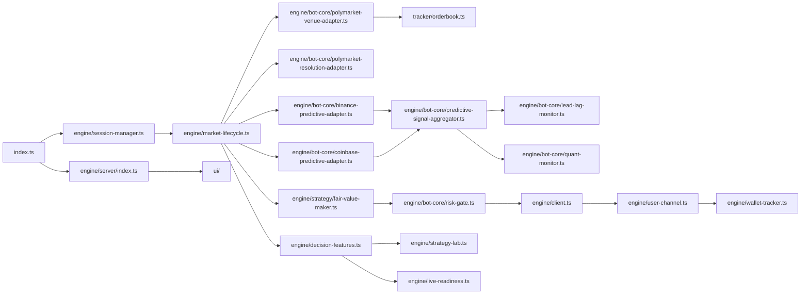

# Radical Polymarket BTC Five-Minute Bot Audit

Scope note. The prompt left the repo URL, radical branch name, and baseline branch name as placeholders. The only concrete target available in the workspace was the GitHub-selected repository `Brogawd876/polymarket-trade-engine-radical`, and the only concrete branch evidence preserved in the attached connector-derived materials was `feat/polymarket-order-flow-metrics`. The same diagnostic states that a full clone-and-run was blocked in this sandbox, so this audit is grounded in connector-derived code inspection plus attached connector-based reports, not a fresh local execution of the radical branch. fileciteturn2file1L5-L19

The direct answer is this: the radical repo is worth mining, but not worth adopting wholesale. Its strongest, most profit-relevant assets are the modular venue and predictive feed stack, the fair-value-maker path, the decision and replay tooling, and the operator telemetry surface. Its weakest parts are the competing legacy runner, the public-trade-flow inference layer, permissive execution defaults, config and auth drift, and UI and CI drift. The right move is **B: cherry-pick selected modules into mainline**, then build one new canonical branch around a single runtime spine headed by `index.ts`, `engine/session-manager.ts`, `engine/market-lifecycle.ts`, the `engine/bot-core/*` adapters, and `engine/strategy/fair-value-maker.ts`. As-is, the branch is too fragmented to bless as the new canonical live engine. fileciteturn2file0L15-L18 fileciteturn2file0L47-L63 fileciteturn2file0L102-L107 fileciteturn2file0L116-L130 fileciteturn2file1L25-L31

## Executive verdict

**Is the radical repo worth integrating.** Yes, selectively. The branch contains real engineering value in five areas: modular market-data adapters, predictive aggregation, fair-value quoting, replay and readiness tooling, and decision telemetry. Those are not superficial experiments. They sit in the runtime spine or immediately adjacent to it, and they map to the repo’s strongest identified files: `engine/bot-core/polymarket-venue-adapter.ts`, `engine/bot-core/polymarket-resolution-adapter.ts`, `engine/bot-core/binance-predictive-adapter.ts`, `engine/bot-core/coinbase-predictive-adapter.ts`, `engine/bot-core/predictive-signal-aggregator.ts`, `engine/bot-core/lead-lag-monitor.ts`, `engine/bot-core/quant-monitor.ts`, `engine/strategy/fair-value-maker.ts`, `engine/decision-features.ts`, `engine/strategy-lab.ts`, and `engine/live-readiness.ts`. fileciteturn2file0L47-L63 fileciteturn2file0L102-L107

**Is it better than the present mainline in any specific area.** The attached evidence indicates that it is better, or at least more developed, in modular feed separation, replay and paper-promotion flow, and operator visibility. The repo was explicitly described as having a cleaner adapter model for venue, predictive, and resolution feeds, plus replay, paper evidence capture, readiness promotion, and operator APIs. Those are meaningfully production-relevant for a BTC five-minute Polymarket bot. fileciteturn2file0L7-L11 fileciteturn2file0L102-L104 fileciteturn2file0L128-L160

**Is it too fragmented to salvage as-is.** Yes. The fragmentation is structural, not cosmetic. The connector-derived inspection shows two orchestration layers: a legacy runner path anchored on `engine/early-bird.ts`, and a newer modular stack under `engine/bot-core/*` with session management, adapters, quant monitors, replay, and readiness tooling. The same materials also show a second layer of fragmentation in configuration and operations: `.env.sample`, `setup_env.py`, and the documented handoff disagree on wallet mode and live prerequisites; the UI hardcodes localhost endpoints; and CI only covers `bun test` on `master`, while the active work discussed in the handoff sits on `feat/polymarket-order-flow-metrics`. fileciteturn2file0L15-L18 fileciteturn2file0L162-L178 fileciteturn2file1L7-L13 fileciteturn2file1L25-L31

**Should the result be stitched, cherry-picked, or restarted from mainline.** Cherry-pick into mainline. A full stitch of the radical branch would carry its runtime conflicts forward. A full restart would throw away genuinely useful modules that are already aligned with the repo’s intended Polymarket strategy framework. The strongest evidence-based middle path is to port the proven modules into the stable line and delete the duplicate or confusing entrypaths there. fileciteturn2file0L11-L11 fileciteturn2file0L17-L18 fileciteturn2file0L200-L200

**Git metadata gap.** The attached materials did not preserve the exact `git status -sb`, HEAD SHA, or the last twenty commit hashes. What they did preserve is the active branch signal `feat/polymarket-order-flow-metrics`, the fact that the current CI ignores that branch, and evidence of recent UI and server fixes landing outside a broader verification matrix. That is enough to diagnose branch quality, but not enough to print an authoritative SHA or working-tree status. fileciteturn2file1L9-L11 fileciteturn2file1L25-L31

## Actual runtime architecture

The best-supported reading of the runtime is a two-spine system, with one spine clearly better than the other. The strong spine is `index.ts` bootstrapping `engine/session-manager.ts` and the Bun operator server in `engine/server/index.ts`, then driving market lifecycle through `engine/market-lifecycle.ts`, `engine/bot-core/*` adapters, `engine/strategy/fair-value-maker.ts`, `engine/bot-core/risk-gate.ts`, `engine/client.ts`, `engine/user-channel.ts`, and `engine/wallet-tracker.ts`. The weaker competing spine is the older `engine/early-bird.ts` path. The attached report is explicit that both exist, and equally explicit that the newer modular layer contains the better-developed feed adapters, monitors, replay pieces, and readiness tooling. fileciteturn2file0L15-L18 fileciteturn2file0L45-L63



The market-truth and data-source audit points to a sensible base architecture, but not a fully trustworthy one. `tracker/orderbook.ts` plus `engine/bot-core/polymarket-venue-adapter.ts` appear to be the canonical local L2 book path. `engine/client.ts` and `engine/user-channel.ts` own order posting, fills, and order lifecycle. `engine/bot-core/polymarket-resolution-adapter.ts` owns settlement-reference and open-close price truth. Binance and Coinbase predictive adapters feed `engine/bot-core/predictive-signal-aggregator.ts`, `lead-lag-monitor.ts`, and `quant-monitor.ts`. Replay, paper evidence, and promotion sit in `engine/strategy-lab.ts`, `engine/live-readiness.ts`, and `engine/decision-features.ts`. That is the right decomposition for a Polymarket bot framework. fileciteturn2file0L45-L63 fileciteturn2file0L91-L108

The weak point is not the decomposition. It is what the strategy treats as authoritative. The order-flow layer currently leans on public-feed trade-direction inference in `tracker/orderbook.ts` and `tracker/trade-tape.ts`. The attached audit says that path heuristically infers side and sometimes records zero size, and recommends replacing it with user fills and, where possible, on-chain `OrderFilled` joins. That recommendation is strongly supported by current Polymarket microstructure research: public-feed trade direction matches on-chain truth only about 59 percent of the time, and Polymarket’s off-chain CLOB means quote-placement and cancel events are not publicly observable, so market-making inference from public tape alone is structurally incomplete. fileciteturn2file0L116-L130 fileciteturn2file0L136-L145 citeturn13academia1turn13academia2

The practical source classification is therefore:

| Source area | Current path | Classification | Should remain authoritative |
|---|---|---|---|
| Market discovery | `tracker/api-queue.ts`, `polymarket-venue-adapter.ts` | Live REST metadata | Yes |
| Polymarket L2 book | `tracker/orderbook.ts` | Live public feed with local cache | Yes, for book state |
| Public trades | `tracker/orderbook.ts`, `tracker/trade-tape.ts` | Live feed with inferred side | No, diagnostics only |
| User fills and order lifecycle | `engine/user-channel.ts` | Live user-channel truth for own flow | Yes |
| Order placement | `engine/client.ts` | Live external CLOB and relayer interaction | Yes |
| Resolution price and open/close refs | `polymarket-resolution-adapter.ts` | Live reference source | Yes |
| Binance and Coinbase inputs | predictive adapters | Live external predictive feeds | Yes, as fair-value inputs |
| Replay and paper evidence | `strategy-lab.ts`, `live-readiness.ts`, `decision-features.ts` | Recorded feed and replay tooling | Yes |
| Event warehouse | no durable canonical full-lifecycle store surfaced | Incomplete | No, must be added |

That classification follows directly from the repo audit and also matches the current external evidence that Polymarket research needs a unified store spanning metadata, fill-level trading records, and oracle-resolution events, rather than a tape-only view. fileciteturn2file0L91-L108 fileciteturn2file0L145-L160 citeturn13academia0turn13academia1turn13academia2

## Fragmentation and module quality

The repo is fragmented in a few places that matter and a few places that do not. The serious overlaps are runtime orchestration, config and auth, CI and UI verification, and live-vs-diagnostic use of flow signals. By contrast, the attached inspection did **not** surface a second independent orderbook implementation or a second independent client stack. `tracker/orderbook.ts` appears to be the canonical local book, wrapped by `engine/bot-core/polymarket-venue-adapter.ts`, not duplicated by it. `engine/client.ts` looks like the canonical order-posting surface. The real duplication is at the orchestration and operational layer, not the raw venue adapter layer. fileciteturn2file0L15-L18 fileciteturn2file0L45-L63 fileciteturn2file0L95-L104

The duplication matrix below lists only overlaps that were actually evidenced in the attached connector-derived materials.

| Concept | Competing files or paths | More complete side | Actually used side | Final decision |
|---|---|---|---|---|
| Runtime spine | `engine/early-bird.ts` vs `index.ts` + `engine/session-manager.ts` + `engine/market-lifecycle.ts` + `engine/bot-core/*` | Modular bot-core spine | Both surfaced; modular spine is stronger | Canonicalize modular spine, archive `engine/early-bird.ts` after extraction |
| Strategy routing | `engine/strategy/late-entry.ts` vs `engine/strategy/fair-value-maker.ts` | FVM path | FVM is the documented live probe target | Keep FVM as champion, move late-entry to research-only |
| Config and auth | `.env.sample` vs `setup_env.py` vs handoff runtime requirements | None; they disagree | Drift caused fresh-setup failures | Replace with one authoritative runtime schema and preflight validator |
| CI and build | `.github/workflows/test.yml` vs real backend plus UI verification needs | Neither; current workflow is too small | Workflow ignores active branch and UI | Replace workflow, do not preserve current one |
| Operator API surface | hardcoded UI URLs vs server-side optional auth and localhost bind | Neither; they conflict | Current local-dev path only | Canonicalize env-driven API client with auth support |
| Order-flow truth | public feed inference vs user fills and on-chain joins | user fills and on-chain joins | Public inference still influences logic | Relegate public tape to diagnostics |

The basis for those decisions is explicit in the attached materials: the repo carries a legacy `early-bird.ts` runner alongside a newer modular stack; fair-value-maker is the clear market-making strategy while late-entry is directional and operationally rougher; config and UI defaults disagree with each other and with the documented live path; CI ignores the active branch and UI; and public tape inference is too weak to trust as live-trading truth. fileciteturn2file0L15-L18 fileciteturn2file0L102-L107 fileciteturn2file0L116-L130 fileciteturn2file1L25-L31 fileciteturn2file1L35-L45 citeturn13academia1turn13academia2

The module scores below are a synthesis, not repo-native metrics. They combine the roles surfaced in the connector-derived inspection with the attached risk analysis.

| Module | Correctness | Integration | Tests | Runtime usage | Strategy value | Profit relevance | Replayability | Observability | Maintainability | BTC 5m fit | Total | Action |
|---|---:|---:|---:|---:|---:|---:|---:|---:|---:|---:|---:|---|
| `engine/strategy/fair-value-maker.ts` | 3 | 4 | 2 | 4 | 5 | 5 | 4 | 4 | 3 | 5 | 39 | Keep as champion |
| `engine/bot-core/predictive-signal-aggregator.ts` | 3 | 4 | 2 | 3 | 5 | 4 | 4 | 3 | 3 | 5 | 36 | Keep, but recalibrate |
| `engine/bot-core/polymarket-venue-adapter.ts` and `tracker/orderbook.ts` | 3 | 4 | 2 | 4 | 4 | 4 | 3 | 3 | 3 | 5 | 35 | Keep |
| `engine/client.ts` and `engine/user-channel.ts` | 3 | 4 | 2 | 4 | 4 | 5 | 3 | 4 | 3 | 5 | 37 | Keep, verify and tighten |
| `engine/decision-features.ts`, `engine/strategy-lab.ts`, `engine/live-readiness.ts` | 4 | 4 | 3 | 3 | 4 | 4 | 5 | 5 | 4 | 4 | 40 | Keep |
| `engine/bot-core/risk-gate.ts` | 2 | 4 | 2 | 4 | 4 | 5 | 3 | 3 | 3 | 5 | 35 | Rewrite, do not discard |
| `engine/server/index.ts` and `ui/` control plane | 3 | 4 | 2 | 4 | 2 | 2 | 2 | 5 | 3 | 3 | 30 | Keep only after auth/env fix |
| `engine/strategy/late-entry.ts` | 2 | 2 | 1 | 2 | 2 | 2 | 3 | 2 | 1 | 3 | 20 | Archive from live spine |

Those scores are justified by the attached evidence that the modular feed, replay, and control pieces are the strongest parts of the repo; that fair-value-maker is the only strategy that clearly behaves like a market-making engine; that risk-gate and client code matter but currently carry serious defaults and operational risks; and that late-entry uses a `setInterval(..., 0)` loop and hard exits that are poor fits for the new canonical live branch. fileciteturn2file0L102-L107 fileciteturn2file0L116-L147 fileciteturn2file0L162-L178

The modules that should be archived or deleted from the live path are therefore clear. `engine/early-bird.ts` should be archived once any missing primitives are extracted into the session-manager and market-lifecycle spine. `engine/strategy/late-entry.ts` should move to research-only or replay-only status; it should not stay in the default live strategy registry. `.github/workflows/test.yml` should be replaced entirely, not incrementally patched. `ui/README.md` should be replaced because it is still a stock Vite template. `setup_env.py` should either be rewritten to derive from one shared runtime schema or be dropped, because its hardcoded defaults currently contradict the intended live path. fileciteturn2file0L15-L18 fileciteturn2file0L123-L124 fileciteturn2file1L25-L31 fileciteturn2file1L115-L167

## Strategy-quality verdict and profit stitching

The attached inspection only surfaced two strategy families with enough evidence to evaluate directly.

| Path | Core idea | Side model | Execution model | Data inputs | Integration status | Verdict |
|---|---|---|---|---|---|---|
| `engine/strategy/fair-value-maker.ts` | Digital fair value plus inventory skew and volatility buffer | Both sides of the Up/Down market | Resting GTC maker-style buy quotes on both sides | Venue state, predictive aggregate, quant inputs, optional flow filters | Active and central | Champion |
| `engine/strategy/late-entry.ts` | Directional late-window entry with certainty, gap, liquidity, and optional flow filters | Likely both, depending on signal, but the attached materials do not resolve all side branches | Directional entry rather than two-sided making | Time-to-close, certainty thresholds, liquidity, gap and volatility filters, optional flow | Present but operationally rough | Research-only |

The connector-derived evidence is clear that only fair-value-maker looks like a true market-making strategy. Late-entry is not worthless, but it belongs in a lab bucket, not the default live BTC five-minute engine. It also carries explicit operational liabilities: busy-loop timing and hard process exits. fileciteturn2file0L102-L107 fileciteturn2file0L123-L124

That makes the strategy verdict straightforward. The benchmark and champion should be **fair-value-maker**, or the closest direct descendant of it already in the stable branch. The first stitched branch should not try to crown a new, more elaborate strategy before it has beaten FVM on replay, paper, blocked-intent counterfactuals, and markouts. The radical repo’s best experiments should therefore attach to FVM as overlays, not replace it outright. fileciteturn2file0L102-L107 fileciteturn2file0L136-L147

The feature-level stitching verdict is below.

| Feature or idea | Verdict | Why |
|---|---|---|
| Calibrated digital fair value | **Keep as core** | This is the centre of FVM and the strategy most aligned with actual maker behaviour in the repo |
| Settlement-source and open-close truth | **Keep as core** | Resolution adapter and price-reference handling are central to a BTC five-minute market |
| Inventory-aware quote skew | **Keep as core** | FVM already uses it, and inventory-aware quoting is consistent with established market-making theory |
| Volatility and jump regime filtering | **Use as optional overlay** | Quant and late-entry filters are useful, but should modulate FVM rather than replace it |
| Maker-first passive execution | **Keep as core** | The repo’s strongest strategy is maker-first rather than taker-first |
| Strict post-only behaviour | **Rewrite and verify** | The attached materials confirm maker-style resting quotes, but not enough end-to-end evidence to treat post-only safety as solved |
| Maker rebate and fee modelling | **Rewrite** | The current economics handling is explicitly incomplete |
| Quote pull and cancel logic | **Keep, then tighten** | Necessary for adverse-selection control, but simulator and maintenance handling are too weak |
| OFI and queue imbalance | **Diagnostics only unless re-sourced from authoritative fills** | Public trade-direction inference is too unreliable for live gating |
| Lead-lag and cross-venue inputs | **Optional overlay** | Strong as fair-value inputs, weaker as standalone fragile triggers |
| Blocked-intent counterfactuals | **Add as core diagnostic** | Decision-features, strategy-lab, and live-readiness are the right home for this |
| Markout analysis | **Add as core diagnostic** | Needed to decide whether gates help or simply suppress good flow |
| Continuous-bankroll replay | **Add before merge** | Replay exists, but the attached materials do not surface a fully canonical bankroll-continuous evaluation path |

The evidence for those decisions is strong. FVM is the only surfaced strategy that clearly operates as a market maker. Signal aggregation, lead-lag monitoring, and quant monitoring are strengths, but the public flow layer is not trustworthy enough to elevate to core without authoritative fills. Current research reinforces that view: public-feed direction is too noisy for serious live microstructure gating, depth decays toward resolution, and a full-lifecycle dataset needs fills plus oracle and metadata joins. The practical implication is that lead-lag and predictive feeds should shape fair value, while public flow should remain a diagnostic until it is re-sourced from user fills or on-chain joins. fileciteturn2file0L99-L107 fileciteturn2file0L116-L147 citeturn13academia0turn13academia1turn13academia2turn14academia1turn14academia3

## Integration plan

The proposed canonical architecture is simple. Keep one runtime spine, one strategy interface, one event schema, and one operator API surface. `index.ts` remains the top-level entrypoint. `engine/session-manager.ts` becomes the only strategy and session selector. `engine/market-lifecycle.ts` owns market state transitions. `engine/bot-core/polymarket-venue-adapter.ts`, `tracker/orderbook.ts`, and `engine/bot-core/polymarket-resolution-adapter.ts` become the sole venue and reference-truth interfaces. `engine/strategy/fair-value-maker.ts` becomes the single live benchmark strategy. `engine/bot-core/predictive-signal-aggregator.ts`, `lead-lag-monitor.ts`, and `quant-monitor.ts` become overlay inputs to that strategy. `engine/client.ts` and `engine/user-channel.ts` stay as the single execution and fill path. `engine/decision-features.ts`, `engine/strategy-lab.ts`, and `engine/live-readiness.ts` become the canonical telemetry and replay spine. `engine/server/index.ts` remains the only operator API surface, with the UI demoted to a thin control plane over that API. fileciteturn2file0L15-L18 fileciteturn2file0L45-L63 fileciteturn2file0L102-L104

The target data model should follow the same rule. Use one append-only event stream with six record types: `MarketMetadataEvent`, `VenueSnapshotEvent`, `PredictiveSnapshotEvent`, `DecisionSnapshotEvent`, `OrderLifecycleEvent`, and `ResolutionEvent`. That is a concrete extension of what the repo already exposes through decision features, replay tooling, and live readiness, and it matches the minimum coherent full-lifecycle data model that current Polymarket research argues for: market metadata, fill-level trade records, and oracle-resolution events. fileciteturn2file0L103-L104 fileciteturn2file0L145-L160 citeturn13academia0

The pull-request sequence should be small and reviewable.

1. **Canonicalize the runtime spine.** Remove any live-path import chains that route directly into `engine/early-bird.ts`. Update `index.ts`, `engine/session-manager.ts`, and `engine/market-lifecycle.ts` so the only live spine is the session-manager plus bot-core path. Extract anything still valuable from `engine/early-bird.ts`, then archive that file. fileciteturn2file0L15-L18

2. **Make fair-value-maker the only live champion.** Keep `engine/strategy/fair-value-maker.ts` as the only default live strategy. Remove `engine/strategy/late-entry.ts` from the live strategy registry. If late-entry contains useful time-to-close or regime filters, move those filters into `engine/bot-core/quant-monitor.ts` or into optional FVM overlays, then archive the live late-entry path. fileciteturn2file0L102-L107 fileciteturn2file0L123-L124

3. **Rewrite market-truth precedence.** Keep `tracker/orderbook.ts` for book state, but remove public-trade direction from any live risk gate or alpha path. Route authoritative flow features through `engine/user-channel.ts` and, if feasible, an on-chain `OrderFilled` join. Demote `tracker/trade-tape.ts` to diagnostics until that join exists. fileciteturn2file0L116-L130 fileciteturn2file0L136-L145 citeturn13academia1turn13academia2

4. **Keep the predictive stack, but subordinate it to FVM.** Move `engine/bot-core/binance-predictive-adapter.ts`, `engine/bot-core/coinbase-predictive-adapter.ts`, `engine/bot-core/predictive-signal-aggregator.ts`, `engine/bot-core/lead-lag-monitor.ts`, and `engine/bot-core/quant-monitor.ts` into the canonical branch unchanged at first. Their job is to shape fair value and quote skew, not to become a separate taker strategy. Rewrite `engine/bot-core/risk-gate.ts` so predictive disagreement is configurable, shadow-measured, and auditable before it blocks profitable flow in production. fileciteturn2file0L102-L107 fileciteturn2file1L29-L31 fileciteturn2file1L115-L167

5. **Tighten execution and economics.** Keep `engine/client.ts`, `engine/user-channel.ts`, and `engine/wallet-tracker.ts`, but rewrite the following before merge: fail-closed execution-quality defaults in `engine/bot-core/risk-gate.ts`; contract-address verification and explicit RPC env support in `engine/client.ts`; explicit maker-fee and rebate modelling in `engine/strategy/fair-value-maker.ts`; and maintenance-window handling keyed to Polymarket restart conditions. fileciteturn2file0L116-L147 fileciteturn2file0L151-L160 fileciteturn2file1L158-L167

6. **Promote telemetry and replay to first-class status.** Keep `engine/decision-features.ts`, `engine/strategy-lab.ts`, and `engine/live-readiness.ts` unchanged initially, then extend them to store blocked decisions, markouts, and replay outcomes under one canonical schema. This is the right home for blocked-intent counterfactuals and continuous-bankroll replay. fileciteturn2file0L103-L104 fileciteturn2file0L145-L160 citeturn13academia0

7. **Fix config, auth, and dependency drift.** Rewrite `.env.sample` and `setup_env.py` to agree on one wallet model. Add `POLY_API_KEY_NONCE`, `CHAINLINK_BTC_5M_REFERENCE_VERIFIED`, and `POLYGON_RPC_URL` to the authoritative runtime config. Make `engine/client.ts` read `POLYGON_RPC_URL`. Add missing direct dependencies the diagnostic flagged, and move TypeScript into `devDependencies`. fileciteturn2file1L25-L31 fileciteturn2file1L115-L176

8. **Replace CI and harden the control plane.** Replace `.github/workflows/test.yml` with a two-job backend and UI workflow that runs on the active branch and on pull requests. Update `ui/src/hooks/useTelemetry.ts` and the control-plane client code to use env-driven REST and WebSocket URLs plus optional bearer auth. Keep `engine/server/index.ts` as the only API surface, but make it auth-capable and no longer implicitly tied to localhost-only frontend assumptions. Replace the stock `ui/README.md`. fileciteturn2file1L25-L31 fileciteturn2file1L61-L93 fileciteturn2file1L193-L235

## Verification gates and final recommendation

The hard limit on verification is simple: the radical repo was not executable inside this sandbox because the attached diagnostic states that full clone-and-run was blocked. That means there is no honest way to claim a local `bun install` or `bun test` pass from this environment. What the attached evidence **does** show is that the current CI only runs `bun test` on `master`, that UI verification is absent, that live startup can succeed while still refusing to trade, and that the correct minimum check set is broader than the repository currently enforces. fileciteturn2file1L17-L19 fileciteturn2file1L25-L31 fileciteturn2file1L53-L78

The required verification commands for the stitched branch should therefore be:

```bash
# backend
bun install
bun run check
bun test

# frontend
cd ui
bun install
bun run lint
bunx vitest run
bun run build
cd ..
```

Those commands come straight from the attached diagnostic and should become the non-negotiable review gate for every PR in the stitching sequence. The current workflow does not do that. The revised workflow proposed in the attached diagnostic should replace the present one. fileciteturn2file1L61-L78 fileciteturn2file1L193-L233

The merge evidence should be replay-first, not live-first. Before any live promotion, the stitched FVM branch should beat the raw FVM champion on at least these holdout criteria: net PnL after fees, fill quality, one-second and five-second markout, cancel-to-fill ratio, drawdown, and blocked-intent counterfactual quality. Any new gate that merely blocks trades without improving net PnL or adverse-selection markout should fail review. That is especially important for predictive disagreement gating and public-flow-derived filters. Research on Polymarket now makes the public-flow caution non-negotiable: public-tape direction is too noisy to use as authoritative live truth, and quote-lifecycle information is not publicly available off-chain. fileciteturn2file0L136-L147 fileciteturn2file1L264-L264 citeturn13academia1turn13academia2

The remaining profit and execution risks are code-specific, not generic. The biggest ones are: the current predictive disagreement blocker can suppress live flow before it is properly calibrated; public trade-direction inference can poison adverse-selection logic; permissive execution defaults can hide bad live economics; simplistic fill simulation can overstate replay EV; missing restart handling can create dead periods or bad re-quote behaviour around maintenance; and config or wallet-mode drift can stop deployment outright or leave the engine in a false-ready state. Those are the risks that matter most to net money and deployability. fileciteturn2file0L116-L147 fileciteturn2file1L7-L13 fileciteturn2file1L35-L45

The final recommendation is **B. cherry-pick selected modules into mainline**. Do not merge the radical repo wholesale. Do not restart from scratch. Extract the modular bot-core adapters, fair-value-maker, decision-features, strategy-lab, live-readiness, and the client and user-channel path; rewrite the risk gate, config layer, CI, and control-plane integration; archive the legacy runner and late-entry from the live path; and make authoritative fills, replay evidence, and markout-based counterfactuals the standard for every future gate change. That is the fastest route to one coherent Polymarket BTC five-minute engine with a credible chance of making real net money rather than just looking sophisticated in code. fileciteturn2file0L7-L11 fileciteturn2file0L15-L18 fileciteturn2file0L102-L107 fileciteturn2file0L136-L160 fileciteturn2file1L25-L31